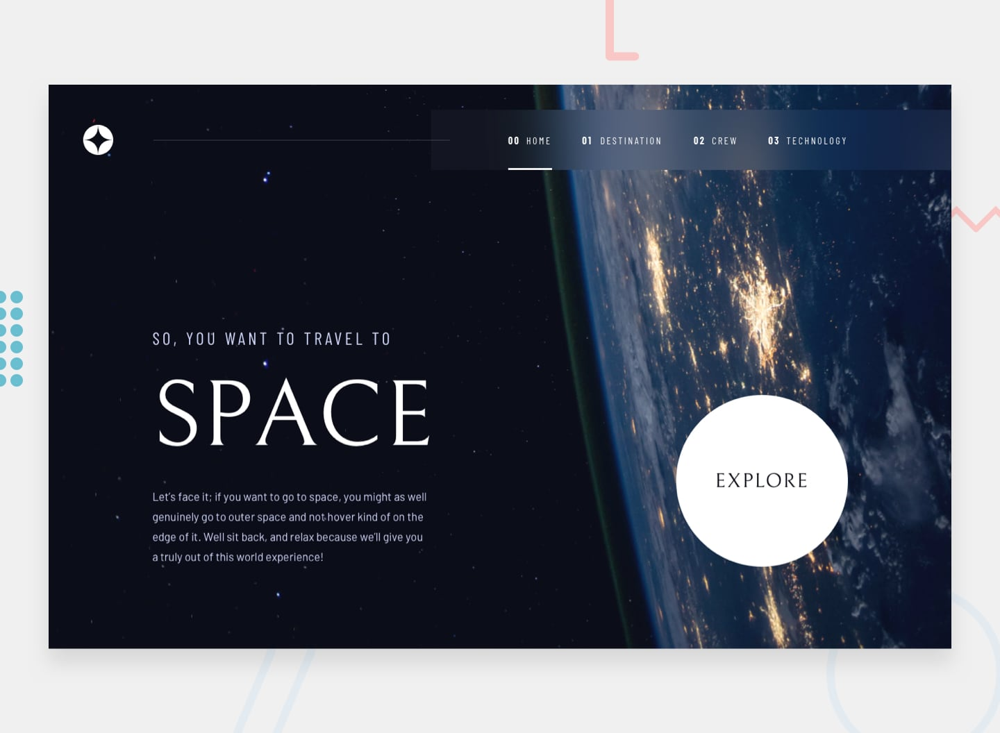

# 🚀 Space Tourism Website

Projeto desenvolvido como solução do desafio **Space Tourism** do **Frontend Mentor**, utilizando **React**, **Vite** e **Tailwind CSS**.

O objetivo foi praticar a criação de uma SPA totalmente responsiva, aplicando boas práticas de organização, componentização e desenvolvimento Front-End.

## 📸 Preview



---

## 🛠 Tecnologias

* React
* Vite
* React Router DOM
* Tailwind CSS
* JavaScript

---

## ✨ Funcionalidades

* Navegação entre páginas com React Router
* Layout totalmente responsivo
* Troca dinâmica de conteúdo utilizando `useState`
* Design fiel ao protótipo do Frontend Mentor
* Imagens diferentes para Mobile, Tablet e Desktop

---

## 📁 Estrutura

```text
src/
├── assets/
├── components/
├── data/
├── layouts/
├── pages/
├── App.jsx
└── main.jsx
```

---

## 📚 Principais aprendizados

Durante este projeto pratiquei:

* Componentização com React
* Organização de projetos em pastas
* React Router e Layouts
* Manipulação de estado com `useState`
* Renderização dinâmica utilizando `map()`
* Responsividade com Tailwind CSS
* Mobile First
* Refinamento de layouts utilizando `clamp()`
* Deploy na Vercel

---

## 🚀 Deploy

Acesse o projeto online:

[Space Tourism](https://space-tourism-seven.vercel.app/)

---

## 🎯 Próximos passos

* Melhorar animações entre páginas
* Implementar transições mais suaves
* Continuar refinando a responsividade
* Aplicar conceitos mais avançados de React em projetos futuros

---

## 👨‍💻 Autor

Desenvolvido por **Mikael Torres**.
